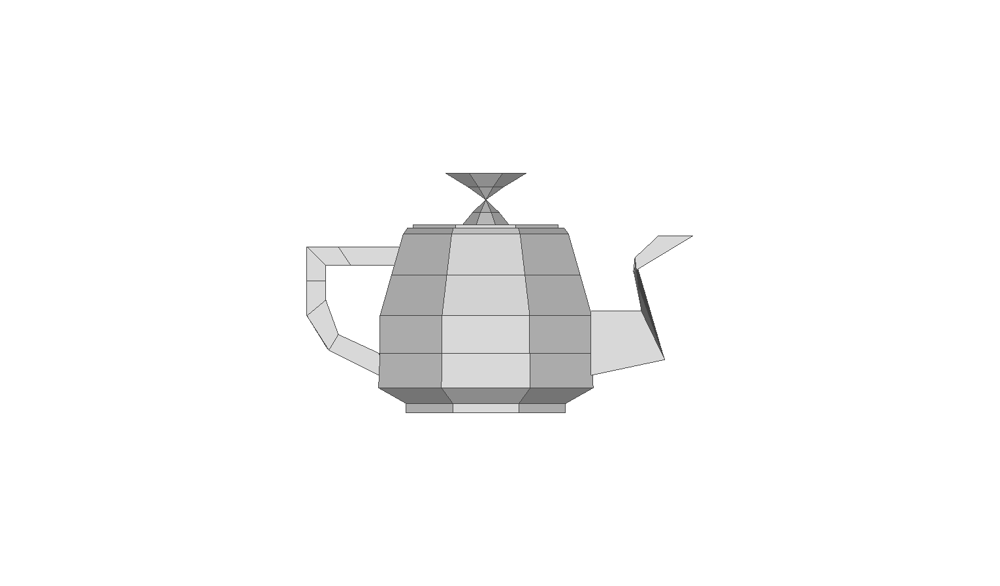
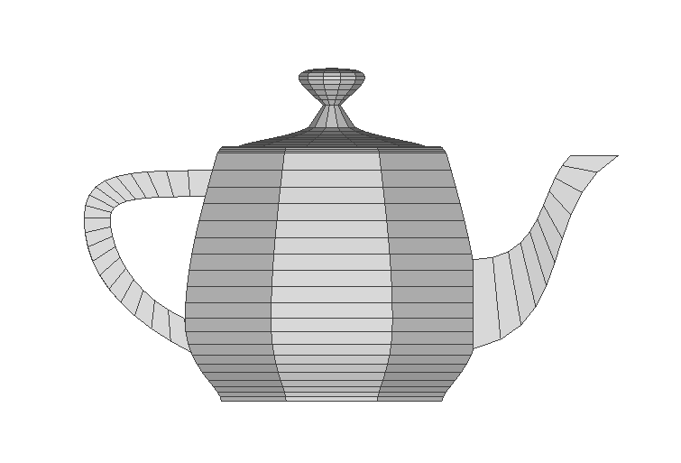

# Gerador de Malhas 3D - Bule de Chá (Teapot)

Este projeto, desenvolvido em **Processing (Java)**, é um exportador de arquivos no formato `.ply` (Polygon File Format) que reconstrói partes do Teapot de Newell do ambiente bidimensional para o tridimensional. Ele utiliza técnicas de **Revolução de Perfis** e suavização geométrica por meio de **Curvas de Bézier Cúbicas**.

---

## Conceitos Fundamentais

### 1. Sólidos de Revolução
A rotação ou revolução é uma técnica computacional para gerar objetos 3D simétricos a partir de um perfil bidimensional (2D). O algoritmo pega cada ponto do perfil e calcula sua nova posição ao longo de um círculo usando coordenadas polares:

* **Eixo X modificado:** $u = x \cdot \cos(\theta) - z \cdot \sin(\theta)$
* **Eixo Y modificado:** $v = y$
* **Eixo Z modificado:** $w = x \cdot \sin(\theta) + z \cdot \cos(\theta)$

Onde $\theta$ varia de $0$ a $2\pi$ baseado no número de **fatias** da malha. Ao conectar os pontos de uma fatia com os pontos da fatia seguinte, criamos faces quadriláteras que formam a superfície do objeto.

### 2. Curvas de Bézier Cúbicas
Para evitar que o bule fique com aspecto "quadrado" ou pontiagudo, aplicamos a equação paramétrica de Bézier Cúbica. Ela utiliza 4 pontos de controle ($P_0, P_1, P_2, P_3$) para traçar uma linha perfeitamente suave através do parâmetro $t$ (que varia de $0.0$ a $1.0$):

$$P(t) = (1-t)^3 P_0 + 3(1-t)^2 t P_1 + 3(1-t) t^2 P_2 + t^3 P_3$$

* **$P_0$ e $P_3$:** São os pontos de início e fim da curva (a malha passa exatamente por eles).
* **$P_1$ e $P_2$:** São os pontos de controle que "atraem" a curva magneticamente, definindo o peso da sua curvatura.

---

## Demonstração Visual

### Perfil Rígido (Apenas Revolução)
Quando rotacionamos apenas os pontos de controle originais do array, a malha final gerada possui faces retas e cantos vivos bem marcados, resultando em um visual Low-Poly com pouca definição.

    

### Perfil Suavizado (Revolução + Curva de Bézier)
Ao integrar a equação cúbica de Bézier, novos vértices são interpolados dinamicamente entre os pontos originais antes de aplicar a rotação. Isso resulta em uma superfície perfeitamente arredondada, orgânica e fluida quando visualizada em softwares de renderização.

  

---

## Como Executar o Projeto

1. Baixe e instale o [Processing IDE](https://processing.org/).
2. Abra os códigos dentro do ambiente do Processing com pastas separadas por nome do arquivo.
3. Clique no botão **Run (Executar)**. 
4. O arquivo `.ply` será gerado automaticamente dentro da pasta do seu rascunho (`sketch`).
5. Para visualizar o resultado tridimensional completo, basta importar os arquivos `.ply` gerados em um visualizador/editor 3D de sua preferência, como o **MeshLab** ou o **Blender**.
